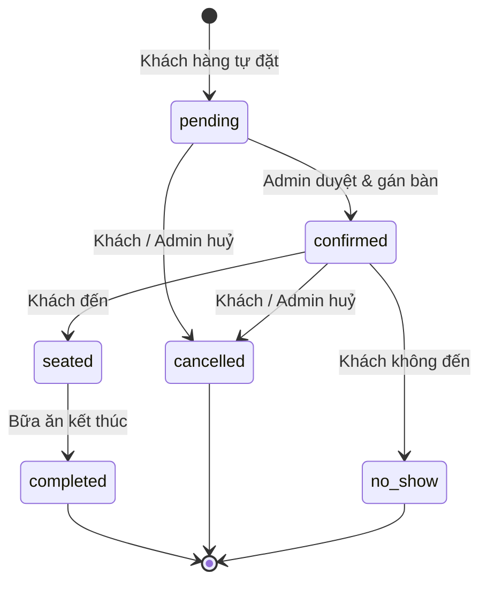
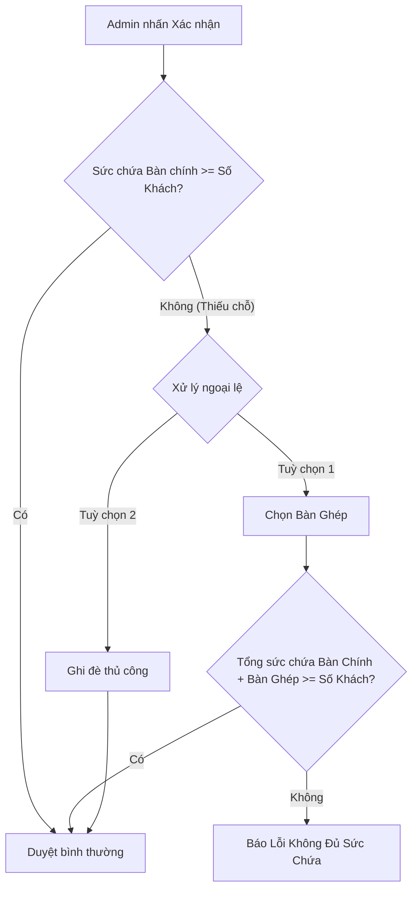
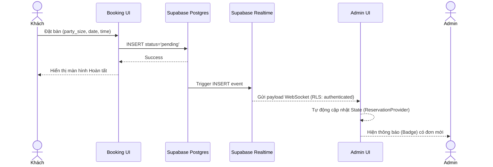

# Booking Core Logic & Business Rules

Tài liệu này mô tả chi tiết toàn bộ logic và quy tắc nghiệp vụ cốt lõi của tính năng đặt bàn (Core Booking Feature) trong hệ thống Flambé Reservation.

## 1. Vòng đời của một Đặt bàn (Reservation Lifecycle)

Mỗi yêu cầu đặt bàn đi qua các trạng thái (status) sau:

1. **`pending` (Chờ xác nhận)**: 
   - Sinh ra khi khách hàng tự đặt qua Form Public.
   - Trạng thái này **chưa có bàn** (table_id = null).
   - **Không giữ chỗ**: Các lượt đặt `pending` không làm giảm sức chứa (capacity) của nhà hàng. Người khác vẫn có thể đặt cùng giờ đó nếu admin chưa duyệt.
   
2. **`confirmed` (Đã xác nhận)**:
   - Admin duyệt và gán bàn (table_id).
   - Bắt đầu **giữ chỗ**: Bàn chính và bàn ghép (nếu có) bị đánh dấu là bận trong khoảng thời gian diễn ra bữa ăn. Các khách khác không thể đặt trùng vào bàn này.
   
3. **`seated` (Đang phục vụ)**:
   - Khách đã đến nhà hàng và đang dùng bữa. Vẫn tiếp tục giữ chỗ.
   
4. **`completed` (Hoàn thành)** / **`cancelled` (Đã huỷ)** / **`no_show` (Không đến)**:
   - Các trạng thái kết thúc. Bàn được giải phóng hoàn toàn và không còn tính vào việc kiểm tra đụng độ giờ (overlap).

## 2. Quy tắc Thời lượng Bữa ăn (Duration Rules)

Thời gian giữ bàn (duration) được tính toán động dựa vào **số lượng khách** (party_size) để tối ưu hoá vòng quay bàn (table turnover).

- **1 - 4 khách**: 120 phút (2 tiếng)
- **5 - 6 khách**: 150 phút (2.5 tiếng)
- **Từ 7 khách trở lên**: 180 phút (3 tiếng)

*Ví dụ:* Một nhóm 4 khách đặt lúc `18:00`, bàn của họ sẽ bị khoá (blocked) từ `18:00` đến `20:00`. Lượt khách tiếp theo chỉ có thể được xếp vào bàn này sớm nhất là `20:00`.

## 3. Quy tắc Giờ Nhận Khách Cuối (Last Booking Slot)

Nhà hàng hoạt động từ Thứ 3 đến Chủ Nhật. **Thứ 2 đóng cửa** (không nhận khách).

Giờ nhận khách cuối cùng (Last Booking Slot) được quy định như sau:
- **Thứ 3 đến Thứ 5**: Giờ nhận khách cuối là `21:00`.
- **Thứ 6 đến Chủ Nhật**: Giờ nhận khách cuối là `21:30`.

**LƯU Ý QUAN TRỌNG:**
- Thời lượng bữa ăn (Duration) **KHÔNG** được dùng để chặn giờ nhận khách cuối. Khách hàng hoàn toàn có thể đặt bàn vào khung giờ muộn nhất (ví dụ: `21:30`) và vẫn được quyền ở lại đủ thời lượng bữa ăn của họ (ví dụ: 120 phút), vượt qua cả giờ "đóng cửa" thông thường.
- Thời lượng bữa ăn (Duration) **CHỈ** được sử dụng để tính toán việc giải phóng bàn (table overlaps) cho các ca tiếp theo.

## 4. Kiểm tra Sức chứa & Bàn ghép (Capacity & Joined Tables)

Khách hàng **không bao giờ được tự chọn bàn**. Họ chỉ chọn Giờ và Số lượng khách. Trách nhiệm xếp bàn thuộc về Admin. Khi Admin xác nhận (`confirmed`), hệ thống sẽ kiểm tra bảo vệ (Capacity Guard):

- **Trường hợp đủ chỗ**: Sức chứa của `table_id` được chọn >= `party_size` -> Duyệt bình thường.
- **Trường hợp thiếu chỗ (Short-capacity)**: Sức chứa của `table_id` < `party_size`. Admin bắt buộc phải thực hiện 1 trong 2 hành động:
  1. **Chọn bàn ghép (Secondary Tables)**: Chỉ định thêm 1 hoặc nhiều bàn phụ (`secondary_table_ids`) ở gần đó để ghép lại. Tổng sức chứa của cụm bàn ghép phải >= `party_size`.
  2. **Ghi đè thủ công (Manual Override)**: Đánh dấu `manual_arrangement = true` xác nhận rằng Admin sẽ tự kê thêm ghế hoặc xử lý riêng biệt nằm ngoài sức chứa vật lý của hệ thống.

## 5. Thuật toán tìm Giờ Trống (Slot Availability Algorithm)

Khi khách hàng chọn một Ngày và Số lượng khách ở Frontend, hệ thống (RPC hoặc Server Action) chạy thuật toán tìm giờ trống như sau:

1. Lấy danh sách toàn bộ các Bàn trong nhà hàng có sức chứa phù hợp (hoặc có khả năng ghép bàn).
2. Lấy danh sách các Đặt bàn đang ở trạng thái `confirmed` hoặc `seated` trong ngày hôm đó (Bỏ qua `pending`, `cancelled`).
3. Tạo các khung giờ (Slot) cách nhau mỗi 15 phút từ giờ mở cửa.
4. Với mỗi slot, áp dụng công thức thời lượng bữa ăn (Duration) để tạo một khoảng thời gian giả định `[SlotStart, SlotEnd]`.
5. Quét qua toàn bộ danh sách Bàn. Một slot được coi là "Trống" nếu có **ít nhất 1 Bàn** thoả mãn:
   - Sức chứa >= Số khách.
   - Bàn đó (và các bàn ghép của nó) không bị giao thoa (overlap) với bất kỳ khoảng thời gian `[Start, End]` của các đặt bàn `confirmed` nào khác trên chính bàn đó.

## 6. Luồng Tương tác Dữ liệu Frontend - Backend

- **Public Booking**: Không cần Authentication. Gọi Server Action `createReservation` (hoặc RPC `public_insert`) để đẩy dòng mới vào table `reservations` với `status = 'pending'`.
- **Admin Dashboard**: Cần Supabase Session (qua Cookie). Render UI với dữ liệu realtime từ Supabase. Trạng thái của toàn bộ danh sách đặt bàn trong ngày được lưu trữ qua `ReservationProvider` (React Context) để các component (Bảng, Lịch, Modal) cùng chia sẻ một nguồn dữ liệu thật nhất. Mọi thao tác Confirm/Edit/Cancel đều đi qua Server Actions và cập nhật trực tiếp vào Postgres database.
